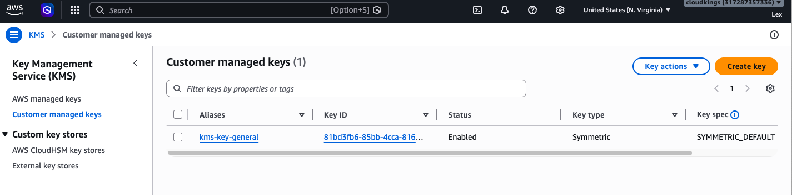

# 🔐 AWS IAM + S3 + KMS Security Project

Designed and implemented a secure AWS storage environment using IAM, S3, and KMS to enforce encryption at rest and least privilege access control.

---

## 🏗️ Architecture Overview
- IAM users and roles with least privilege access
- S3 bucket secured with server-side encryption (SSE-KMS)
- Customer-managed KMS key for encryption control
- Bucket tagging for access organization (ABAC-ready)

---

## 🛠️ Security Features Implemented
- Created IAM users and assigned controlled permissions
- Configured a customer-managed KMS key
- Enabled SSE-KMS encryption on S3 bucket
- Applied bucket-level encryption policies
- Controlled access to encryption keys via IAM

---

## 🔑 KMS Key Created

## ⚙️ KMS Configuration

## 🔐 S3 Encryption Enabled

## 📦 S3 Object Upload

---

## 🎯 Outcome
Built a secure AWS storage solution demonstrating real-world cloud security practices:
- Data encryption at rest using KMS
- Identity-based access control (IAM)
- Secure key management and access policies

---

## 🧠 What I Learned
- Difference between SSE-S3 and SSE-KMS
- How IAM controls access to encrypted resources
- Importance of least privilege access
- How KMS integrates with S3 for secure storage

---

## ⚠️ Security Considerations
- Restricted KMS key access to specific IAM users only
- Ensured all S3 objects are encrypted
- Prevented unauthorized access using IAM policies
- Centralized encryption key management with KMS

---

## 🧰 Skills Demonstrated
- AWS IAM
- Amazon S3 Security
- AWS KMS
- Encryption (SSE-KMS)
- Access Control (RBAC / ABAC basics)
